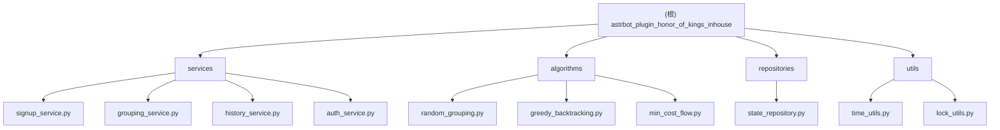

# 王者荣耀内战报名分组插件

> AstrBot 插件 - 提供王者荣耀内战的报名管理、智能分组、历史统计等功能

## 变更记录 (Changelog)

### 2026-02-23 20:34:56
- 初始化项目文档
- 完成架构扫描与模块识别

---

## 项目愿景

为 AstrBot 聊天机器人提供完整的王者荣耀内战组织功能，支持玩家报名、智能分组、对局归档和历史统计，提升内战组织效率和公平性。

## 架构总览

### 技术栈
- **语言**: Python 3.10+
- **框架**: AstrBot Plugin API
- **架构模式**: 分层架构（Presentation → Application → Domain → Infrastructure）
- **并发控制**: asyncio + 群组级锁
- **数据持久化**: JSON 文件 + 原子写入

### 核心特性
- 报名系统（随机模式 / 智能模式）
- 智能分组算法（贪心回溯 / 最小费用最大流）
- 数据过期机制（5小时 TTL + 午夜重置）
- 对局历史与胜率统计
- 管理员权限控制

### 模块结构图



## 模块索引

| 模块 | 路径 | 职责 |
|------|------|------|
| **插件入口** | `main.py` | AstrBot 插件注册与命令路由 |
| **数据模型** | `models.py` | 领域实体定义（Player、SignupPool、MatchRecord 等） |
| **常量定义** | `constants.py` | 枚举、配置常量、错误码映射 |
| **异常处理** | `errors.py` | 业务异常类定义 |
| **命令解析** | `command_parser.py` | 分路参数解析与验证 |
| **序列化** | `schemas.py` | JSON 序列化/反序列化 |
| **服务层** | `services/` | 业务逻辑封装（报名、分组、历史、权限） |
| **算法层** | `algorithms/` | 分组算法实现（随机、贪心、MCMF） |
| **仓储层** | `repositories/` | 数据持久化与并发控制 |
| **工具层** | `utils/` | 时间处理、锁管理 |

## 运行与开发

### 安装
```bash
# 将插件目录复制到 AstrBot 插件目录
cp -r astrbot_plugin_honor_of_kings_inhouse /path/to/astrbot/plugins/

# 重启 AstrBot
```

### 命令列表
```
/报名 [分路1] [分路2]    # 报名（无参数=随机模式）
/取消报名                # 取消当前报名
/报名列表                # 查看报名情况
/随机分组                # 10人随机分配
/智能分组                # 根据偏好智能分配
/历史对局                # 查看最近10场
/胜率统计                # 红蓝方胜率
/归档对局 [红|蓝|平]     # 记录对局结果
/清空报名                # 管理员清空报名池
```

### 数据存储
- **路径**: `data/hok_inhouse_state.json`
- **备份**: `data/hok_inhouse_state.json.bak`
- **格式**: JSON（UTF-8 编码）

## 测试策略

### 当前状态
- 无自动化测试
- 依赖手动测试与日志验证

### 建议补充
- 单元测试：算法模块（`algorithms/`）
- 集成测试：服务层业务流程
- 并发测试：锁机制与数据一致性

## 编码规范

### Python 风格
- 遵循 PEP 8
- 使用 Type Hints
- Docstring 格式：Google Style

### 命名约定
- 类名：PascalCase（如 `SignupService`）
- 函数/变量：snake_case（如 `get_chat_state`）
- 常量：UPPER_SNAKE_CASE（如 `MAX_PLAYERS`）
- 私有方法：前缀 `_`（如 `_cleanup_expired_internal`）

### 异步规范
- 所有 I/O 操作使用 `async/await`
- 群组操作必须获取锁：`async with await repository.with_chat_lock(chat_id)`

## AI 使用指引

### 关键上下文
1. **入口文件**: `main.py` - 理解命令路由与事件处理
2. **数据模型**: `models.py` - 掌握核心实体结构
3. **服务层**: `services/` - 业务逻辑的主要实现位置
4. **算法层**: `algorithms/` - 分组算法的独立实现

### 常见任务
- **添加新命令**: 在 `main.py` 中添加 `@filter.command` 装饰器方法
- **修改分组逻辑**: 编辑 `algorithms/` 中的算法文件
- **调整数据模型**: 修改 `models.py` 并同步更新 `schemas.py`
- **优化持久化**: 修改 `repositories/state_repository.py`

### 注意事项
- 修改数据模型时需考虑向后兼容性
- 所有状态修改必须通过 `repository.update_chat_state()` 持久化
- 异常处理统一使用 `errors.py` 中定义的业务异常

---

**版本**: 1.0.0
**作者**: Claude
**许可证**: MIT License
